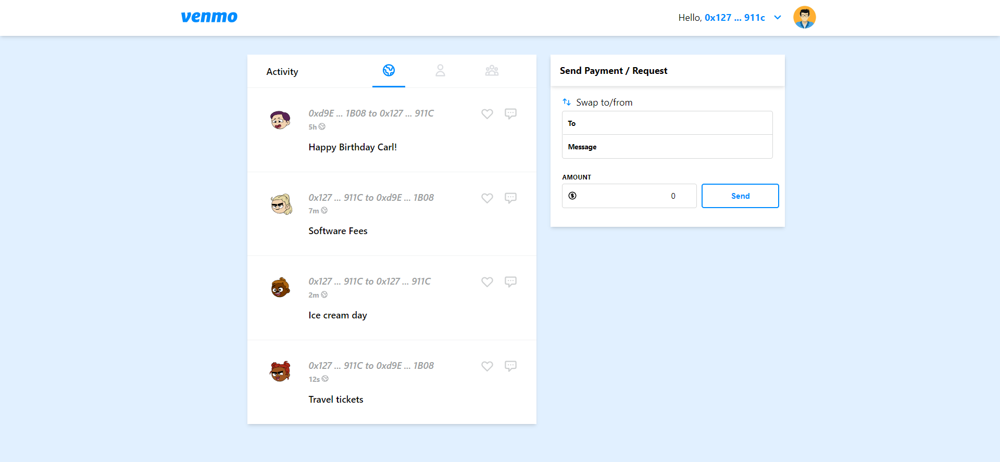
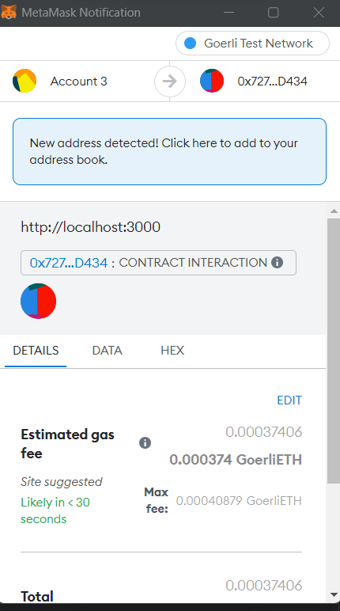
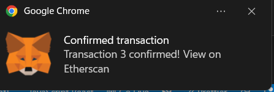

# Venmo (React/Solidity/Ethereum/Infura)

This is a peer to peer payments app project using infura on the goerli testnet to send funds from one Ethereum account to another

## Dependencies

- Install dependencies with npm
- Use Metamask as a block explorer

<h2 id="screenshots">Screenshots</h2>

<h6> Transaction and Timeline Page </h6>

<h6> Metamask Transaction </h6>

<h6> Metamask Confirmation </h6>

